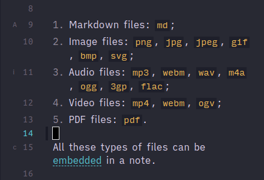

# Obsidian Vim Gutter Marker

This plugin adds gutter markers for *vim marks*.

## Settings

If line numbers are activated, the markers can be shown either before or after them.

## Known limitations

When switching to an "empty file" in the same pane and switching back, the gutter markers don't get reset.

If marks get deleted, this is not reflected in the gutter. The same thing applies to reusing the same mark character.

## Installation

The plugin can be installed manually or via BRAT. It is not in the community plugins.

## Credits

The gutter implementation is based on [Obsidian lapel](https://github.com/liamcain/obsidian-lapel/blob/dce7a1d9fc8ac9a2c8d3589b0e4f92d1f0241f39/src/headingWidget.ts).

The key capture is adapted from [this PR comment](https://github.com/mrjackphil/obsidian-jump-to-link/issues/35#issuecomment-1085905668).
